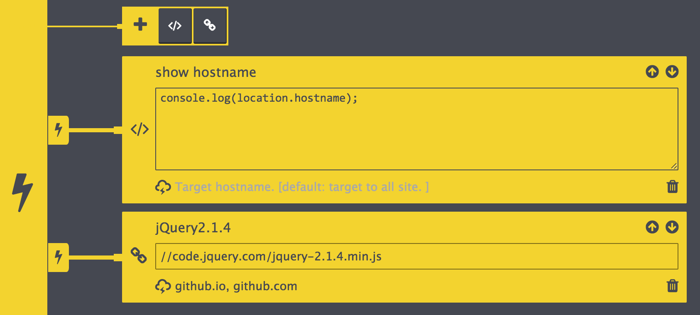
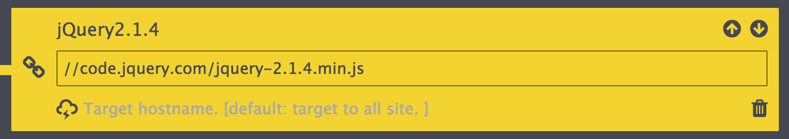
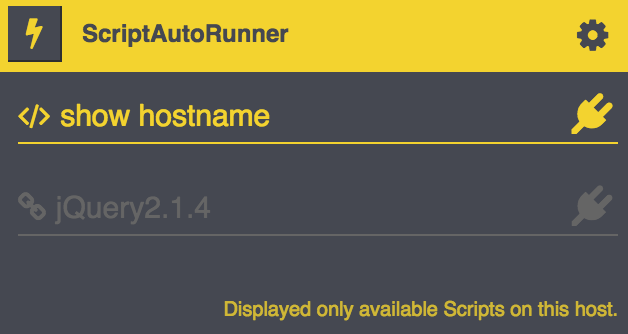

# ScriptAutoRunner

Injects to any Script into a Website. It can be autorun as well.



## Install

Download & install from Chrome Webstore.

## Feature

* Injects external JavaScript library by URL 
* Injects snippet by your own code then

Also injected Scripts are executed automatically.


## Usage

Manage Scripts on options page.

Open from popup or [chrome://extensions/](chrome://extensions/).


### Add library

Click link icon. Then you write file's URL.



### Add Snippet

Click code icon. Then you write your own code.


### Filter by hostname.

By default, Scripts are executed all Website.

You can manage executed Scripts by hostname.

Expected value is String or Array(split by comma).

```
github.io, github.com
```


### Temporary disable

When you would like to disable Scripts temporary.

You can manage Scripts on options and popup.

Click plug icon then toggle enable/disable.


